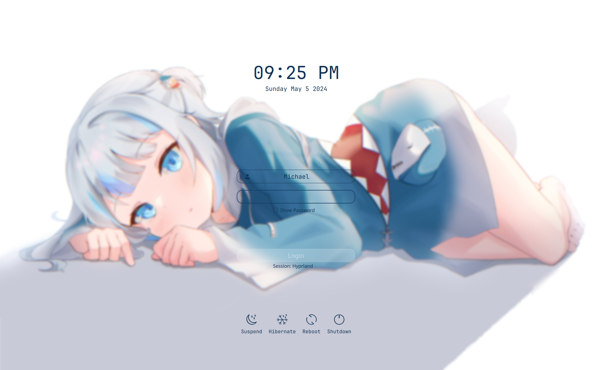

<div align="center">
  <h1>Gura-SDDM</h1>
  <p>A Gawr Gura SDDM Theme based off of <a href="https://github.com/Kangie/sddm-sugar-candy">SDDM Sugar Candy</a>.</p>

  <h1>Preview</h1>
  
</div>

# Usage

## Installation

In order to install Gura-SDDM, you can follow these steps.

```bash
$ git clone https://github.com/FireStreaker2/Gura-SDDM.git
$ sudo mv Gura-SDDM /usr/share/sddm/themes/
```

## Setting Gura-SDDM

To actually use Gura-SDDM, make sure to edit your SDDM configuration so that it has the following line:

```
Current=gura-sddm
```

> If you don't know where your SDDM configuration file is located, you can run `man sddm.conf` for more help.

## Configuration

In order to edit how the login screen looks, you can modify the `theme.conf` file.

# License

[GNU General Public License](https://github.com/FireStreaker2/Gura-SDDM/blob/main/COPYING)
